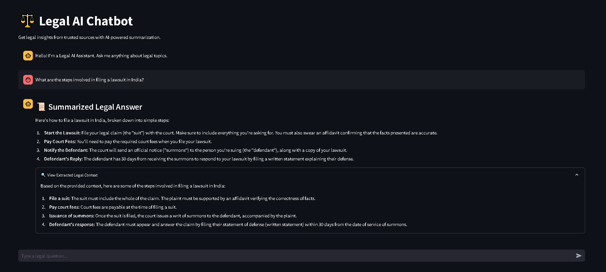

# ⚖️ Legal AI Chatbot

[](https://legal-ap.streamlit.app/)




## 📌 Project Overview
Legal AI Chatbot is an AI-powered application that provides **trusted legal insights** by retrieving relevant legal documents and summarizing complex legal concepts. The chatbot leverages **Retrieval-Augmented Generation (RAG)** to fetch the most relevant legal context and uses advanced **LLM-based summarization** to simplify legal jargon into understandable language.

## 🚀 Features
- **Natural Language Legal Query Handling**
- **Retrieval-Augmented Generation (RAG)** for accurate responses
- **AI-powered Legal Text Summarization**
- **Chat History Maintenance**
- **Expandable Legal Context Viewer**

## 🏗️ Tech Stack
- **Python** (Backend logic)
- **Streamlit** (Frontend UI)
- **FAISS** (Vector database for legal document retrieval)
- **Google Generative AI (Gemini 2.0)** (LLM for query handling & summarization)
- **LangChain** (LLM Orchestration)


## 📂 Project Structure
```
├── app.py                  # Streamlit-based chatbot UI
├── query_agent.py          # Retrieves relevant legal documents
├── summarize_agent.py      # Summarizes legal text using LLM
├── vector_store.py         # FAISS-based vector database for storing embeddings
├── requirements.txt        # Dependencies
├── Data/                   # Folder containing legal PDFs
├── main.py                 # For Deploying in Streamlit Cloud


```

## 🛠️ Installation
### 1️⃣ Clone the Repository
```sh
git clone https://github.com/PriyanshuDey23/Legal_Chatbot.git
cd legal-ai-chatbot
```
### 2️⃣ Create a Virtual Environment & Install Dependencies
```sh
python -m venv venv
source venv/bin/activate  # On Windows: venv\Scripts\activate
pip install -r requirements.txt
```
### 3️⃣ Set Up Environment Variables
Create a **.env** file in the root directory and add:
```ini
GOOGLE_API_KEY=your_google_api_key
LLM_MODEL_NAME=gemini-2.0-flash
```

## ▶️ Usage
### 1️⃣ Run the Chatbot
```sh
streamlit run app.py
```
### 2️⃣ Upload Legal Documents (PDFs)
- Place legal PDFs in the `Data/` folder.
- The chatbot will automatically process and index them.

### 3️⃣ Ask Legal Questions
- Enter your query in the chat input field.
- The chatbot retrieves **relevant legal documents** and **summarizes** the response.
- View the **extracted legal text** in the expandable section.


## 🏛️ License
This project is licensed under the **MIT License**.

